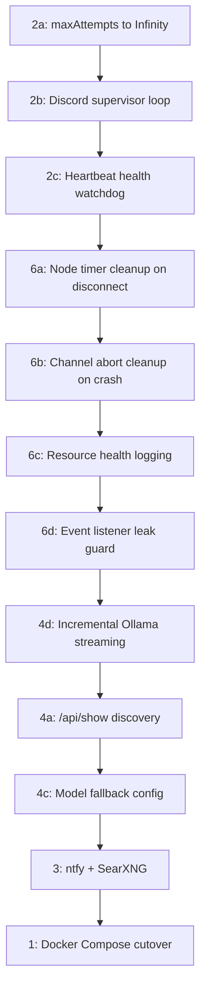

# Gateway Stability Plan -- Consolidated Update (Feb 17 2026)

This consolidates and updates both prior plan files. Phase 5 is complete, Phase 4b is complete, and several memory-leak fixes have already landed. The remaining work is re-prioritized around your primary pain: **having to restart the gateway daily**.

## Root Cause Analysis: Why Daily Restarts Are Needed

Based on codebase analysis, likely contributors to degradation over time:

1. **Discord connection exhaustion**: `maxAttempts: 50` in [src/discord/monitor/gateway-plugin.ts](src/discord/monitor/gateway-plugin.ts) means after 50 reconnect attempts, the Discord monitor **exits** and never restarts. No supervisor loop re-creates it. Once Discord dies, the gateway is alive but deaf.
2. **Node presence timer leak**: `nodePresenceTimers` in [src/gateway/server.impl.ts](src/gateway/server.impl.ts) are only cleared on full shutdown, not when individual nodes disconnect. Over time, disconnected nodes leave orphaned `setInterval` timers.
3. **Channel abort controller accumulation**: `ChannelRuntimeStore.aborts` in [src/gateway/server-channels.ts](src/gateway/server-channels.ts) can accumulate if a channel crashes without cleanup.
4. **No memory/resource monitoring**: No periodic logging of Map/Set sizes, heap usage, or connection state. Degradation is invisible until symptoms appear.
5. **Ollama response latency**: The native streaming provider accumulates the **entire response** before emitting a single `done` event. Combined with Discord coalescing (1000ms idle, 1500-char minimum), this adds perceptible delay that may appear as "unresponsiveness."

---

## Completed (Deprecate from Plans)

These items from the prior plans are **done** and should be marked complete/removed:

- **Phase 5a** (fork isolation) -- done, prompt-engine well-isolated
- **Phase 5b** (upstream sync CI) -- done, `.github/workflows/upstream-sync-test.yml` implemented
- **Phase 4b** (Ollama streaming) -- done, native `/api/chat` provider in `src/agents/ollama-stream.ts`
- **Memory leak fixes** (2026.2.15-2026.2.16) -- diagnostics, agentRunSeq, ABORT_MEMORY, Slack thread cache, outbound directory cache, remote-skills cache, QMD buffering all bounded

---

## Phase 2: Discord Connection Resilience (Highest Priority)

**Goal**: Gateway never goes deaf on Discord without human intervention.

### 2a. Increase reconnect ceiling

In [src/discord/monitor/gateway-plugin.ts](src/discord/monitor/gateway-plugin.ts), change `maxAttempts: 50` to `Infinity` (or a very large number like 10000). Carbon already does exponential backoff; the cap is the only issue.

### 2b. Add supervisor loop around Discord monitor

In [src/discord/monitor/provider.ts](src/discord/monitor/provider.ts) (or at the call site in [src/plugins/runtime/index.ts](src/plugins/runtime/index.ts)), wrap `monitorDiscordProvider` in a restart-on-failure loop:

- Catch the "Max reconnect attempts" / "Fatal Gateway error" exit
- Wait with exponential backoff (30s, 60s, 120s, cap at 5min)
- Log each restart cycle with subsystem logger
- Respect the abort signal (stop supervisor when gateway shuts down)

**Pre-step**: Review reverted PR #17 (`a65935154`) at `https://github.com/philga7/openclaw-fork/pull/17` to understand what failed in the prior attempt. The CV2 rewrite (`9203a2f`) may have changed internals that PR #17 depended on.

### 2c. Connection health watchdog

- Track `lastSuccessfulHeartbeat` timestamp in the Discord monitor
- Add a periodic check (every 2-3 min) that logs a warning if heartbeat is stale > 5 min
- Optionally send ntfy alert (wire in Phase 3, but log-only is fine initially)

**Key files**:

- [src/discord/monitor/gateway-plugin.ts](src/discord/monitor/gateway-plugin.ts) (maxAttempts)
- [src/discord/monitor/provider.ts](src/discord/monitor/provider.ts) (supervisor, health tracking)
- [src/plugins/runtime/index.ts](src/plugins/runtime/index.ts) (call site)

---

## Phase 6 (NEW): Gateway Resource Leak Hardening

**Goal**: Eliminate slow resource leaks that degrade the gateway over 24+ hours.

### 6a. Node presence timer cleanup on disconnect

In [src/gateway/server.impl.ts](src/gateway/server.impl.ts), when a node disconnects (WebSocket close), clear and delete its entry from `nodePresenceTimers`. Currently these timers are only cleared in the shutdown handler in [src/gateway/server-close.ts](src/gateway/server-close.ts).

### 6b. Channel abort controller cleanup on crash

In [src/gateway/server-channels.ts](src/gateway/server-channels.ts), ensure `store.aborts` entries are cleaned up when a channel crashes or is force-stopped, not just on clean shutdown.

### 6c. Periodic resource health logging

Add a maintenance timer (every 5-10 min) that logs sizes of key Maps/Sets:

- `nodePresenceTimers.size`
- `chatAbortControllers.size`
- `dedupe.size`
- `agentRunSeq.size`
- `process.memoryUsage().heapUsed`

This makes degradation visible in logs before symptoms appear. Add to [src/gateway/server-maintenance.ts](src/gateway/server-maintenance.ts).

### 6d. Event listener leak guard

In [src/infra/agent-events.ts](src/infra/agent-events.ts) and [src/infra/heartbeat-events.ts](src/infra/heartbeat-events.ts), add a safety cap on listener count (e.g., warn at 50, reject at 100) to catch cases where cleanup callbacks are never called.

**Key files**:

- [src/gateway/server.impl.ts](src/gateway/server.impl.ts) (node timer cleanup)
- [src/gateway/server-channels.ts](src/gateway/server-channels.ts) (abort cleanup)
- [src/gateway/server-maintenance.ts](src/gateway/server-maintenance.ts) (resource logging)
- [src/infra/agent-events.ts](src/infra/agent-events.ts) (listener cap)

---

## Phase 4: Ollama Cloud Responsiveness (Remaining Items)

### 4a. Detailed model discovery via `/api/show`

In [src/agents/models-config.providers.ts](src/agents/models-config.providers.ts), after the `/api/tags` call, optionally call `/api/show` for each model to get actual `context_length`. Gate behind a config flag or auto-enable for cloud hosts (`OLLAMA_HOST` set). The current hardcoded `contextWindow: 128000` may be wrong for some models.

### 4d (NEW). Incremental streaming to Discord

Currently [src/agents/ollama-stream.ts](src/agents/ollama-stream.ts) accumulates the **entire** response before emitting a single `done` event. This means Discord sees nothing until the full response is ready, then the coalescing/chunking pipeline adds more delay.

Change the native Ollama stream to emit incremental `text-delta` events as chunks arrive (similar to how the AI SDK `streamSimple` works), rather than waiting for `done: true`. This would let the block reply pipeline start sending partial messages to Discord while the model is still generating.

### 4c. Model fallback chain

Config-only: set up fallback models in `openclaw.json` so a transient Ollama Cloud failure on the primary model falls back to a secondary.

**Key files**:

- [src/agents/models-config.providers.ts](src/agents/models-config.providers.ts) (discovery)
- [src/agents/ollama-stream.ts](src/agents/ollama-stream.ts) (incremental streaming)

---

## Phase 3: ntfy + SearXNG Integration (Lower Priority)

Still fully pending, unchanged from prior plan:

- **3a**: Create `src/infra/ntfy.ts` notification service, wire to hooks for gateway events, Discord failures, cron failures
- **3b**: Add `"searxng"` to `SEARCH_PROVIDERS` in [src/agents/tools/web-search.ts](src/agents/tools/web-search.ts) for self-hosted web search

These are quality-of-life improvements that don't directly affect the daily-restart problem.

---

## Phase 1: Docker Compose Unification (Final Step)

Unchanged from prior plan. Do this last after the code-level stability improvements are proven:

- Create `docker-compose.prod.yml` with gateway + ntfy + SearXNG
- Create `scripts/deploy.sh` for zero-downtime rebuilds
- Migrate config/state to Docker volumes
- Retire systemd

---

## Updated Implementation Order

**Priority tiers**:

1. **Immediate** (fixes daily restart): Phase 2 (Discord resilience) + Phase 6 (leak hardening)
2. **Soon** (improves responsiveness): Phase 4a/4c/4d (Ollama improvements)
3. **When ready** (quality of life): Phase 3 (ntfy + SearXNG)
4. **Final** (infra cutover): Phase 1 (Docker)

---

## Deprecated Items

- Phase 5a, 5b: Complete -- remove from active tracking
- Phase 4b: Complete -- remove from active tracking
- Memory leak fixes (agentRunSeq, ABORT_MEMORY, etc.): Landed -- remove from active tracking
- Prior plan Gantt chart: Stale -- replaced by the flowchart above
