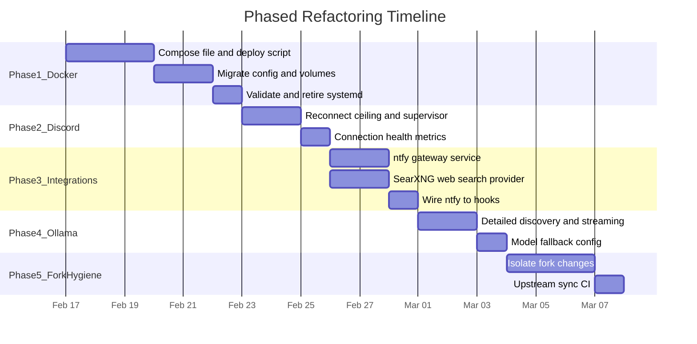

# Phased Stability Refactor for OpenClaw Fork

## Current State Summary

Your fork runs on a **Linux VPS with systemd**, using:

- **Discord** for communications (via Carbon WebSocket gateway)
- **Ollama Cloud** (`OLLAMA_HOST=https://ollama.com`) for models
- **Cron jobs** (in-process timer with anti-zombie hardening)
- **Skills** (ClawdBot-Next prompt-engine + workspace skills)
- **Dockerized ntfy and SearXNG** as separate services
- **OpenClaw-Foundry** and **ClawdBot-Next** integrations
- **Systemd** for the gateway itself (not Docker)

Your top pain points: **build races / dist disappearing**, **Discord connection drops**, and **general fragility**.

---

## Present Setup Locations (Ubuntu VPS — Don't Lose Anything)

Use this as the single checklist for where every current artifact lives before the transition. On your VPS, the gateway runs as the user whose home is `~`; from [MAINTENANCE.md](docs/MAINTENANCE.md) that is **root**, so `~` = `/root` unless you run as another user. If you set `OPENCLAW_HOME` or `OPENCLAW_STATE_DIR`, replace `~` with that value below.

### Gateway process and service

| What                     | Where to find it                                                                                              |
| ------------------------ | ------------------------------------------------------------------------------------------------------------- |
| Systemd unit file        | `~/.config/systemd/user/openclaw-gateway.service`                                                             |
| ExecStart / node path    | Inside that file: e.g. `/usr/bin/node /root/projects/openclaw-fork/dist/index.js gateway run --port 18789`    |
| Env vars for the gateway | Same file, `Environment=` and `EnvironmentFile=` lines; also any `~/.openclaw/.env` or repo `.env` you source |

### Repo and build output

| What                                    | Where to find it                                                             |
| --------------------------------------- | ---------------------------------------------------------------------------- |
| Fork repo (code + bundled skills)       | `/root/projects/openclaw-fork` (from MAINTENANCE)                            |
| Built dist (including skills.json copy) | `/root/projects/openclaw-fork/dist/` (gitignored; recreated by `pnpm build`) |
| Bundled skills (source)                 | `/root/projects/openclaw-fork/skills/`                                       |

### OpenClaw state directory (config, data, credentials)

All of these live under the **state dir**. Default is `~/.openclaw` (so `/root/.openclaw`). Override: `OPENCLAW_STATE_DIR` or `OPENCLAW_HOME` (tilde expansion uses `OPENCLAW_HOME` when set).

| What                               | Path (under state dir)                                                                                |
| ---------------------------------- | ----------------------------------------------------------------------------------------------------- |
| Main config                        | `~/.openclaw/openclaw.json` (or legacy `clawdbot.json` / `moltbot.json` / `moldbot.json` in same dir) |
| Optional env overlay               | `~/.openclaw/.env`                                                                                    |
| Cron job store (default)           | `~/.openclaw/cron/jobs.json` (or path from `cron.store` in config)                                    |
| Credentials (web provider, etc.)   | `~/.openclaw/credentials/`                                                                            |
| Managed skills (overrides, shared) | `~/.openclaw/skills/`                                                                                 |
| Hooks                              | `~/.openclaw/hooks/`                                                                                  |
| Sessions (per-agent)               | `~/.openclaw/agents/<agentId>/sessions/` (e.g. `sessions.json`, `*.jsonl`)                            |
| Agent dirs (model catalog, etc.)   | `~/.openclaw/agents/<agentId>/agent/` (e.g. `models.json`)                                            |
| Memory / QMD index                 | `~/.openclaw/memory/` (or path from `agents.defaults.memorySearch.store.path`)                        |
| Extensions (installed plugins)     | `~/.openclaw/extensions/`                                                                             |
| Workspace (default)                | Often `~/.openclaw/workspace` or a path set in config `agents.defaults.workspace`                     |
| Media cache                        | `~/.openclaw/media/`                                                                                  |
| Gateway TLS                        | `~/.openclaw/gateway/tls/`                                                                            |
| OAuth state                        | `~/.openclaw/oauth/` (or `OPENCLAW_OAUTH_DIR`)                                                        |

### Legacy state dirs (if you ever used ClawdBot/Moltbot)

If the app was first run with an older name, state may live under: `~/.clawdbot`, `~/.moltbot`, `~/.moldbot`. The codebase checks these and uses the first that exists; otherwise uses `~/.openclaw`.

### ntfy (current Docker or host setup)

| What                            | Where to find it                                                                                                                              |
| ------------------------------- | --------------------------------------------------------------------------------------------------------------------------------------------- |
| ntfy topic / URL                | Env var `NOTIFY_NTFY` (e.g. in cron or systemd that runs `auth-monitor.sh`); or in `scripts/auth-monitor.sh` / `scripts/setup-auth-system.sh` |
| Auth monitor state file         | `$HOME/.openclaw/auth-monitor-state` (from `scripts/auth-monitor.sh`)                                                                         |
| Existing ntfy compose/container | Whatever dir you use for ntfy (e.g. `~/ntfy`, `~/docker/ntfy`) — **compose file and any volume mounts** so you can reuse topic and config     |

### SearXNG (current Docker setup)

| What                      | Where to find it                                                                                                                                                                |
| ------------------------- | ------------------------------------------------------------------------------------------------------------------------------------------------------------------------------- |
| SearXNG compose/container | Whatever dir you use for SearXNG (e.g. `~/searxng`, `~/docker/searxng`) — **compose file and config volume** (e.g. `settings.yml`) so you can reuse or merge into the new stack |

### openclaw-agent repo (scripts, memories, artifacts + git-push cron)

You store scripts, memories, and other artifacts in [github.com/philga7/openclaw-agent](https://github.com/philga7/openclaw-agent) and have a cron job that regularly pushes changes to git. To preserve this and fit the plan:

| What                                   | Where to find it                                                                                                                                                                                                                         |
| -------------------------------------- | ---------------------------------------------------------------------------------------------------------------------------------------------------------------------------------------------------------------------------------------- |
| Clone of openclaw-agent on the VPS     | e.g. `/root/projects/openclaw-agent` (or wherever you cloned it) — this is the dir the gateway uses as workspace (or that contains scripts/memories the agent uses).                                                                     |
| Config pointing at that workspace      | In `~/.openclaw/openclaw.json`: `agents.defaults.workspace` or per-agent `agents.list[].workspace` (value is the path on the host, e.g. `~/projects/openclaw-agent` or absolute).                                                        |
| Memory search over that repo (if used) | `agents.defaults.memorySearch.extraPaths` — may include paths relative to that workspace or absolute paths into the clone.                                                                                                               |
| Cron job that pushes to GitHub         | Host crontab (`crontab -l` as the user that runs it) or an OpenClaw cron job (in-process) that runs a skill/exec to do `git add` / `commit` / `push`. Note which user and command (e.g. `cd /root/projects/openclaw-agent && git push`). |
| Git credentials for push               | SSH key (e.g. `~/.ssh/id_ed25519`) or token used by the push cron; must remain available to whoever runs the push (host or container).                                                                                                   |

### Other binaries and global installs (possible "dirty" artifacts)

| What                   | Where to find it                                                                |
| ---------------------- | ------------------------------------------------------------------------------- |
| Global npm openclaw    | `/usr/lib/node_modules/openclaw` or `npm root -g` output; `which openclaw`      |
| pnpm global openclaw   | e.g. `~/.local/share/pnpm/openclaw` (or `pnpm root -g`)                         |
| Backup of service file | e.g. `~/.config/systemd/user/openclaw-gateway.service.backup` (if you made one) |

### Per-phase: what to capture so nothing is lost

- **Phase 1 (Docker)** — Capture: entire `~/.openclaw` (or your effective state dir); contents of `~/.config/systemd/user/openclaw-gateway.service`; all env vars from that service and from `~/.openclaw/.env`; current ntfy and SearXNG compose/config paths; repo path and optional `skills` dir; **openclaw-agent clone path and git-push cron** (see [Integration: openclaw-agent repo and git-push cron](#1d-integration-openclaw-agent-repo-and-git-push-cron)). Back up before migrating into Docker volumes.
- **Phase 2 (Discord)** — No new paths; Discord token and config already live in env or `~/.openclaw/openclaw.json` (`channels.discord.accounts.*`).
- **Phase 3 (ntfy + SearXNG)** — Current ntfy topic and base URL (env or script); current SearXNG URL and config dir (see ntfy/SearXNG rows above). New code will read from env/compose; no separate on-disk migration.
- **Phase 4 (Ollama)** — `OLLAMA_HOST` and `OLLAMA_API_KEY` already in service env or `~/.openclaw`; model fallback list in `openclaw.json` under `agents.defaults.model`.
- **Phase 5 (fork hygiene)** — Fork-only code and docs are in the repo (`FORK-CHANGES.md`, `.agent/workflows/update_clawdbot.md`, `src/agents/prompt-engine/`, etc.); no separate host paths.

---

## Should You Switch from Discord?

**Short answer: No -- Discord is the right channel for your setup.**

Discord is one of the three most mature channels in the codebase (alongside Telegram and Slack). It offers features the others lack for your use case:

- **Role-based agent routing** (`bindings[].match.roles`) -- critical if you run multiple agents via Foundry
- **Exec approvals via buttons** (DM-based approval flows)
- **Thread support** for isolating cron-triggered conversations
- **Slash commands** for native skill invocation
- **Voice messages** (OGG/Opus)
- **PluralKit support**

Telegram would be simpler (HTTP long-polling, less connection state) but lacks role-based routing and has weaker threading. The connection drops you're seeing are solvable (Phase 2) without switching channels.

**Recommendation:** Stay on Discord, but harden it (Phase 2).

---

## Should You Dockerize the Gateway?

**Short answer: Yes -- this is the single biggest stability win.**

You already run ntfy and SearXNG in Docker. The gateway running bare on systemd is the source of your two biggest pain points:

1. **Build races** -- `pnpm build` replaces files under the running process. Docker eliminates this: you build a new image, then swap containers. The old container keeps running old code until the new one is ready.
2. **General fragility** -- service file overwrites, `git clean -fd` nuking `dist/`, `openclaw doctor` clobbering your config. Docker isolates all of this.

The past "efficiency" concern with Docker was likely the dev-cycle friction of rebuilding images. The plan below separates **development** (keep using systemd/pnpm locally) from **production** (Docker Compose on VPS), so you get the best of both.

---

## Phase 1: Docker Compose Unification (Eliminates Build Races)

**Goal:** Single `docker-compose.yml` that runs gateway + ntfy + SearXNG together, with zero-downtime deploys.

### 1a. Create a production compose file

Create `docker-compose.prod.yml` at the repo root. This extends the existing `[docker-compose.yml](docker-compose.yml)` but adds ntfy and SearXNG as sibling services:

```yaml
services:
  openclaw-gateway:
    build:
      context: .
      dockerfile: Dockerfile
    environment:
      OLLAMA_HOST: https://ollama.com
      OLLAMA_API_KEY: ${OLLAMA_API_KEY}
      OPENCLAW_GATEWAY_TOKEN: ${OPENCLAW_GATEWAY_TOKEN}
      GATEWAY_BOOTSTRAP_TIMEOUT: "120000"
      OPENCLAW_SINGLETON_TOOLS: ${OPENCLAW_SINGLETON_TOOLS:-}
      DISCORD_BOT_TOKEN: ${DISCORD_BOT_TOKEN}
      NTFY_BASE_URL: http://ntfy:80
      NTFY_TOPIC: ${NTFY_TOPIC:-openclaw-alerts}
      SEARXNG_BASE_URL: http://searxng:8080
    volumes:
      - openclaw-config:/home/node/.openclaw
      - openclaw-workspace:/home/node/.openclaw/workspace
      - ./skills:/app/skills:ro
    ports:
      - "18789:18789"
      - "18790:18790"
    depends_on:
      ntfy:
        condition: service_healthy
      searxng:
        condition: service_healthy
    restart: unless-stopped
    healthcheck:
      test:
        [
          "CMD",
          "node",
          "-e",
          "fetch('http://localhost:18789/health').then(r => process.exit(r.ok ? 0 : 1))",
        ]
      interval: 30s
      timeout: 10s
      retries: 3

  ntfy:
    image: binwiederhier/ntfy
    command: serve
    volumes:
      - ntfy-cache:/var/cache/ntfy
    ports:
      - "8093:80"
    healthcheck:
      test: ["CMD", "wget", "-q", "--spider", "http://localhost:80/v1/health"]
      interval: 30s
      timeout: 5s
      retries: 3
    restart: unless-stopped

  searxng:
    image: searxng/searxng
    volumes:
      - searxng-config:/etc/searxng
    ports:
      - "8094:8080"
    healthcheck:
      test: ["CMD", "wget", "-q", "--spider", "http://localhost:8080/healthz"]
      interval: 30s
      timeout: 5s
      retries: 3
    restart: unless-stopped

volumes:
  openclaw-config:
  openclaw-workspace:
  ntfy-cache:
  searxng-config:
```

### 1b. Zero-downtime deploy script

Create `scripts/deploy.sh`:

- `docker compose -f docker-compose.prod.yml build openclaw-gateway`
- `docker compose -f docker-compose.prod.yml up -d openclaw-gateway` (recreates only the gateway)
- ntfy and SearXNG stay running during gateway rebuilds
- The old container serves traffic until the new one passes its health check

### 1c. Migrate config and cron store

- Copy the **entire state dir** (see [Present setup: OpenClaw state directory](#present-setup-locations-ubuntu-vps--dont-lose-anything)) into the Docker volume used by the gateway (e.g. populate the volume from `~/.openclaw/` so `openclaw.json`, `cron/jobs.json`, `credentials/`, `agents/`, `skills/`, etc. are all present).
- The cron store lives at `~/.openclaw/cron/jobs.json` by default (or path from `cron.store` in config); it will persist in the volume after migration.
- Skills directory is bind-mounted read-only from the repo (e.g. `/root/projects/openclaw-fork/skills` or your repo path).

### 1d. Integration: openclaw-agent repo and git-push cron

Your scripts, memories, and artifacts live in [github.com/philga7/openclaw-agent](https://github.com/philga7/openclaw-agent), and a cron job regularly pushes changes. Here's how that fits.

**Workspace = openclaw-agent clone (bind mount)**

- Keep the **openclaw-agent** clone on the **host** at a fixed path (e.g. `/root/projects/openclaw-agent`). Do not put it only inside an anonymous Docker volume, or the host cron cannot run `git` there.
- In `docker-compose.prod.yml`, bind-mount that path into the gateway so the agent sees it as its workspace. If openclaw-agent is your sole/default workspace:
  ```yaml
  volumes:
    - openclaw-config:/home/node/.openclaw
    - /root/projects/openclaw-agent:/home/node/.openclaw/workspace:rw
  ```
  If you also use a separate default workspace, mount the clone alongside it (e.g. `/home/node/.openclaw/workspace/openclaw-agent`).
- In `openclaw.json` (in the config volume), set `agents.defaults.workspace` to the path **inside the container** that corresponds to that mount (e.g. `/home/node/.openclaw/workspace`). The gateway runs as `node`, so use the container path.
- If you use `memorySearch.extraPaths`, point them at paths relative to that workspace so the agent can search scripts/memories in the repo.

**Cron that pushes to git — two options**

1. **Host cron (recommended)**
   Keep the push on the **host** so git and SSH/token stay on the host:

- Crontab (e.g. `crontab -l` for root): run `cd /root/projects/openclaw-agent && git add -A && git status --short && git commit -m "sync $(date +%Y-%m-%d)" && git push` (or your existing script) on a schedule.
- The gateway container writes into the same dir via the bind mount; the host cron commits and pushes. No change to the plan.

1. **OpenClaw cron (in-process)**
   If the push is an OpenClaw cron job (exec or skill): the exec runs **inside** the container, so the image would need `git` and push credentials. The current Dockerfile does not install git; prefer host cron for git push unless the agent must trigger it.

**What to capture before migration:** exact host path of the openclaw-agent clone; whether the push cron is host crontab or OpenClaw cron (and the command); `agents.defaults.workspace` and any `memorySearch.extraPaths` that reference this repo.

### 1e. Retire the systemd service

- After validating Docker Compose works, disable the systemd unit
- The `MAINTENANCE.md` warnings about `openclaw doctor` overwrites become irrelevant

**Key files to create/modify:**

- New: `docker-compose.prod.yml`
- New: `scripts/deploy.sh`
- Modify: `[docs/MAINTENANCE.md](docs/MAINTENANCE.md)` (update deployment section)

---

## Phase 2: Discord Connection Hardening

**Goal:** Eliminate dropped connections and missed messages.

The Discord gateway uses [Carbon](https://github.com/buape/carbon) (`@buape/carbon/gateway`) with `reconnect: { maxAttempts: 50 }` in `[src/discord/monitor/gateway-plugin.ts](src/discord/monitor/gateway-plugin.ts)`. There's also a 30s HELLO timeout in `[src/discord/monitor/provider.ts](src/discord/monitor/provider.ts)` that forces reconnect on stalled connections. But 50 max attempts can be exhausted during extended network blips.

### 2a. Increase reconnect ceiling and add exponential backoff logging

In `[src/discord/monitor/gateway-plugin.ts](src/discord/monitor/gateway-plugin.ts)`:

- Increase `maxAttempts` from 50 to something effectively unlimited (e.g., `Infinity` or 500)
- The Carbon library already does exponential backoff; the cap is the issue

### 2b. Add a supervisor loop around the Discord monitor

In `[src/discord/monitor/provider.ts](src/discord/monitor/provider.ts)`, wrap `monitorDiscordProvider` in a restart-on-failure supervisor that:

- Catches gateway errors that exhaust reconnect attempts
- Waits with exponential backoff (30s, 60s, 120s, max 5min)
- Logs to the subsystem logger
- Sends an ntfy notification on repeated failures (wired via the ntfy integration from Phase 3)

### 2c. Add connection health metrics

- Track last successful heartbeat timestamp
- Expose via `openclaw channels status --probe` (already exists but can be enriched)
- Add a cron job that checks Discord health and sends ntfy alert if stale > 5 minutes

**Key files to modify:**

- `[src/discord/monitor/gateway-plugin.ts](src/discord/monitor/gateway-plugin.ts)` (reconnect config)
- `[src/discord/monitor/provider.ts](src/discord/monitor/provider.ts)` (supervisor loop, health tracking)
- `[src/discord/gateway-logging.ts](src/discord/gateway-logging.ts)` (enhanced logging for reconnect events)

---

## Phase 3: ntfy Deep Integration + SearXNG Web Search Provider

**Goal:** ntfy becomes a first-class notification backend; SearXNG becomes a self-hosted web search provider.

### 3a. ntfy notification service

Currently ntfy is only used in `[scripts/auth-monitor.sh](scripts/auth-monitor.sh)` (auth expiry alerts via curl). Promote it to a proper gateway-level service:

- Create `src/infra/ntfy.ts`: a small client that POSTs to `NTFY_BASE_URL`/`NTFY_TOPIC` with title, priority, tags, and optional actions
- Wire it into the internal hooks system (`[src/hooks/internal-hooks.ts](src/hooks/internal-hooks.ts)`) for:
  - `gateway:start` / `gateway:stop`
  - Discord connection failures (Phase 2c)
  - Cron job failures
  - Ollama discovery failures
- Configuration: `notifications.ntfy.baseUrl`, `notifications.ntfy.topic`, `notifications.ntfy.events[]`

### 3b. SearXNG as a web search provider

The current web search tool (`[src/agents/tools/web-search.ts](src/agents/tools/web-search.ts)`) supports Brave, Perplexity, and Grok as providers (`SEARCH_PROVIDERS`). SearXNG is not integrated at all.

Add `"searxng"` to `SEARCH_PROVIDERS`:

- Endpoint: `SEARXNG_BASE_URL` env var (defaults to `http://localhost:8080`)
- API: SearXNG JSON API (`/search?q=...&format=json`)
- No API key required (self-hosted)
- Configuration: `tools.web.search.provider: "searxng"` or `tools.web.search.searxng.baseUrl`
- Results mapping: SearXNG returns `{ results: [{ title, url, content, engine }] }` -- map to the existing `BraveSearchResult`-like shape

This gives your agent self-hosted, private web search with no external API dependency.

**Key files to create/modify:**

- New: `src/infra/ntfy.ts`
- Modify: `[src/agents/tools/web-search.ts](src/agents/tools/web-search.ts)` (add SearXNG provider)
- Modify: `[src/hooks/internal-hooks.ts](src/hooks/internal-hooks.ts)` (wire ntfy to hook events)
- Modify: `[src/config/types.ts](src/config/types.ts)` (add ntfy + SearXNG config types)

---

## Phase 4: Ollama Cloud Optimization

**Goal:** Reliable model discovery and streaming for Ollama Cloud.

### 4a. Fix discovery to use /api/show

The `[docs/providers/ollama.md](docs/providers/ollama.md)` claims discovery uses `/api/show` for per-model metadata, but the actual code in `[src/agents/models-config.providers.ts](src/agents/models-config.providers.ts)` only uses `/api/tags` and hardcodes `contextWindow: 128000`. For Ollama Cloud, this matters because different models have different context windows.

- After `/api/tags`, call `/api/show` for each model to get actual `context_length` and `tools` capability
- Gate this behind a config flag (`models.providers.ollama.discovery.detailed: true`) to avoid slowing down local Ollama

### 4b. Re-enable streaming

Streaming is disabled for Ollama due to SDK issue #1205. Investigate whether this is fixed in the current `ollama` npm package (v0.6.3+) and re-enable with a fallback:

- Try streaming; if it fails, fall back to non-streaming and log a warning
- This significantly improves perceived latency for Discord responses

### 4c. Model fallback chain

Configure a proper fallback chain in `openclaw.json`:

```json
{
  "agents": {
    "defaults": {
      "model": {
        "primary": "ollama/<your-preferred-model>",
        "fallbacks": ["ollama/<backup-model>"]
      }
    }
  }
}
```

**Key files to modify:**

- `[src/agents/models-config.providers.ts](src/agents/models-config.providers.ts)` (detailed discovery)
- `[src/agents/models-config.ts](src/agents/models-config.ts)` (streaming toggle)

---

## Phase 5: Upstream Merge Strategy and Fork Hygiene

**Goal:** Reduce merge pain and make the fork easier to maintain long-term.

### 5a. Isolate fork changes

Currently fork-specific code is spread across core files (`src/agents/system-prompt.ts`, `src/discord/monitor/provider.ts`, etc.). Where possible, extract fork-specific logic into:

- Separate files that import from core (e.g., `src/agents/prompt-engine/` is already well-isolated)
- Config-gated code paths (e.g., `if (cfg.promptEngine?.enabled)`) rather than replacing core functions

### 5b. Automated upstream sync testing

Create a CI workflow (`.github/workflows/upstream-sync-test.yml`) that:

- **Daily**, fetches upstream `main`
- Attempts a merge into a test branch
- Runs `pnpm build && pnpm test`
- Opens an issue if conflicts or failures are detected (see FORK-CHANGES.md “Phase 5” for what “opens an issue” means)

### 5c. Contribute generic improvements upstream (deferred)

Not implemented in this phase. Changes that are not fork-specific (Discord reconnect hardening, SearXNG provider, ntfy service, Ollama `/api/show` discovery) could later be submitted as PRs to upstream OpenClaw to reduce merge surface over time.

**Key files to create/modify:**

- New: `.github/workflows/upstream-sync-test.yml`
- Modify: `[FORK-CHANGES.md](FORK-CHANGES.md)` (Phase 5 and Phase 1–4 when applicable)

---

## Implementation Order and Dependencies

**Chosen order:** Phases **2 → 3 → 4 → 5**, then **Phase 1** last. All of 2–5 are implemented on the current systemd setup; Phase 1 (Docker cutover) is done when ready. See [Logistics](#logistics-implementing-phases-while-keeping-your-current-setup) for how each phase fits the current direct setup.



**Phase 1 is the highest-priority and highest-impact change.** It directly eliminates build races and most of the "general fragility" by making deploys atomic. Phase 2 addresses your Discord drops. Phases 3-5 are quality-of-life improvements that build on the stable foundation.

---

## Logistics: Implementing Phases While Keeping Your Current Setup

You can do **Phases 2, 3, 4, and 5 on your current systemd setup** without Docker. Only **Phase 1** is a one-time cutover from systemd to Docker. Below is how each phase fits the "current direct setup" (gateway via systemd, config in `~/.openclaw`, repo on the VPS).

### Phases 2, 3, 4, 5 — No cutover; deploy as you do today

- **Phase 2 (Discord)** — Code-only. You implement the changes, run `pnpm build`, then restart the gateway (`systemctl --user restart openclaw-gateway`). Your current setup is unchanged; you just run new code. No new services or moves.
- **Phase 3 (ntfy + SearXNG)** — Code + config. ntfy and SearXNG already run (e.g. in their own containers). You add the gateway code that calls them and set env or config (e.g. `NTFY_TOPIC`, SearXNG base URL). Gateway still runs under systemd; it talks to ntfy/SearXNG at their current host URLs (e.g. `http://localhost:8093`). No need to move ntfy/SearXNG into one compose until Phase 1.
- **Phase 4 (Ollama)** — Config + optional code (discovery/streaming). You adjust `openclaw.json` and/or env and restart. No infrastructure change.
- **Phase 5 (fork hygiene)** — Repo-only (isolate code, add CI workflow). Nothing runs differently on the VPS; you just merge and push.

So you can do **2 → 3 → 4 → 5** on the current direct setup, deploying each via stop → build → start (and config edits). Order is flexible; e.g. you can harden Discord (2) and add ntfy/SearXNG (3) before touching Docker.

### Phase 1 (Docker) — One-time cutover; current setup until then

Phase 1 replaces **how** the gateway runs (systemd → Docker). You cannot run both production gateways at once (same Discord token and same ports). So you keep the current setup until you decide to switch.

**Option A: Prepare Phase 1, then single cutover (recommended)**

1. **While still on systemd:** Add `docker-compose.prod.yml`, `scripts/deploy.sh`, and the openclaw-agent bind mount (1a, 1b, 1d). Do not start the stack yet.
2. **One-time move:** Stop the gateway (`systemctl --user stop openclaw-gateway`). Populate the Docker config volume from `~/.openclaw` (1c). Start the stack (`docker compose -f docker-compose.prod.yml up -d`). Use the same ports (18789/18790) so clients and cron keep working. Validate (Discord, cron, openclaw-agent workspace, git-push cron).
3. **Retire systemd:** Disable the unit (1e). From then on, deploy via `./scripts/deploy.sh`.

During step 1 your current setup is unchanged. The "move" is the stop → copy config → start Docker in step 2. Downtime is the few minutes between stop and validated start.

**Option B: Test Docker in parallel, then cut over**

If you want to de-risk: run the new stack on **different ports** (e.g. 18799/18798) with a **copy** of config (and a second Discord bot token or no Discord) to test. Current systemd gateway keeps running. When satisfied, do the real cutover: stop systemd, point the compose file at the real ports and real config volume (populated from `~/.openclaw`), start the stack, validate, retire systemd.

### Summary table

| Phase | Can do on current (systemd) setup? | Logistical note                                                                                                                       |
| ----- | ---------------------------------- | ------------------------------------------------------------------------------------------------------------------------------------- |
| 1     | No — replaces how gateway runs     | One-time cutover: stop systemd → populate volume → start Docker → validate → retire systemd. Prepare 1a/1b/1d while still on systemd. |
| 2     | Yes                                | Code + restart. No infra change.                                                                                                      |
| 3     | Yes                                | Code + config; gateway (systemd) calls existing ntfy/SearXNG.                                                                         |
| 4     | Yes                                | Config (+ optional code); restart.                                                                                                    |
| 5     | Yes                                | Repo/CI only; no runtime change.                                                                                                      |

Implementation order for this fork: **2 → 3 → 4 → 5** on the current direct setup, then **Phase 1** as the final step when ready to cut over to Docker.

---

## How Integrating Upstream OpenClaw Commits Works (With This Plan)

**Day-to-day mechanics stay the same.** You still integrate upstream OpenClaw the way you do today:

1. **Fetch and rebase (or merge):**

```bash
 git fetch upstream
 git rebase upstream/main   # or: git merge upstream/main --no-edit
```

1. **Resolve conflicts** using the patterns in [FORK-CHANGES.md](FORK-CHANGES.md) and [.agent/workflows/update_clawdbot.md](.agent/workflows/update_clawdbot.md) (e.g. keep fork behavior in `system-prompt.ts`, `paths.ts`, `pi-tool-definition-adapter.ts`, etc.).
2. **Build and test:** `pnpm install && pnpm build && pnpm test`
3. **Deploy:** With Phase 1 in place, you run `./scripts/deploy.sh` (Docker) instead of `systemctl --user restart openclaw-gateway`. The repo stays a normal fork; you never push to `upstream`.

**What the plan adds:**

- **Phase 5b (CI)** — A **daily** workflow that fetches `upstream/main`, attempts the merge on a throwaway branch, runs `pnpm build && pnpm test`, and **opens an issue** if there are conflicts or failures. It does **not** merge for you; it alerts you so you can integrate upstream when you choose and fix problems in a controlled way.
- **Phase 5a (isolation)** — Moving fork-only logic into separate files or config-gated paths means fewer of "your" lines sit in the same files as upstream edits, so future merges tend to have fewer conflicts.
- **Phase 5c (contributing back)** — Deferred; not part of the current Phase 5 implementation.

**Summary:** Integrate upstream the same way you do now; the plan adds early warning (CI), fewer conflicts (isolation), and less fork-only code over time (contributing back). Deployment after a merge switches from systemd restart to Docker deploy.

---

## What Stays the Same

- **ClawdBot-Next prompt-engine** -- untouched, already well-isolated in `src/agents/prompt-engine/`
- **OpenClaw-Foundry** -- works the same, just runs inside Docker now (bootstrap timeout env var is set in compose)
- **Cron system** -- in-process timer with anti-zombie hardening stays; it runs inside the container and the cron store persists in a Docker volume
- **Skills** -- workspace skills bind-mounted from the repo; managed skills in the Docker volume
- **Singleton tools** -- `OPENCLAW_SINGLETON_TOOLS` set via compose environment
